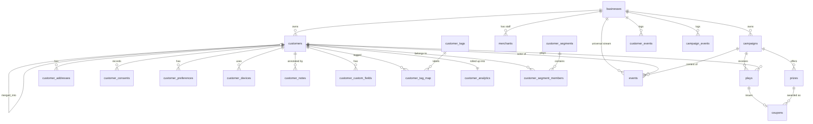

# EngageOS — Customer Data Platform (CDP) Architecture

**Status:** Phase 1 shipped (migrations `0034`–`0037`). Later phases designed on paper below.
**Principle:** Database-first, event-driven, tenant-isolated, strictly additive. Every future module builds on durable business events and the customer record — never duplicates them.

---

## 1. Principles & constraints

1. **Multi-tenant isolation.** Every tenant table carries `business_id uuid not null references businesses(id) on delete cascade`. Tables scoped only by a child key (e.g. `prizes` via `campaign_id`) enforce tenancy through a join. RLS is default-deny; all grants revoked from `anon`/`authenticated`. Writes go through `SECURITY DEFINER` RPCs invoked by trusted server code (service role) that re-check ownership in SQL. `business_id` is always resolved from the merchant session, never the URL.
2. **Event-driven.** Important business actions emit durable events. Three logs, each append-only (immutability enforced by `BEFORE UPDATE/DELETE` triggers):
   - `customer_events` (0011) — the campaign funnel. 8 locked types. **Unchanged.**
   - `campaign_events` (0016) — merchant/system lifecycle audit. **Unchanged.**
   - `events` (0035) — **the universal cross-domain stream.** Commerce, loyalty, marketing, communication, AI all write here.
3. **Additive-only evolution.** New columns are nullable/defaulted; new tables/RPCs never modify existing signatures. The play/scan/redeem/coupon/WATI/tracking engines are untouched. This is how we avoid a schema redesign as domains land.
4. **Read models over premature denormalization.** Analytics are `SECURITY DEFINER stable` functions over the logs (pattern from 0014/0017). Materialized rollups (`customer_analytics`) are introduced only where per-request recomputation would be too slow.

---

## 2. Naming & conventions (enforced)

| Concern | Convention |
|---|---|
| Tables | snake_case; plural for entities (`customers`), singular for logs (`customer_events`, `events`) |
| Tenant column | `business_id` NN FK cascade (companion tables also denormalize it for direct RLS/index scope) |
| Timestamps | `created_at` default `now()`; `updated_at` maintained by shared `set_updated_at()` trigger (0034) |
| Mutations | `merchant_*` RPCs, ownership-checked |
| Event writers | `record_*` RPCs |
| Read models | noun/verb `SECURITY DEFINER stable` functions |
| Params / locals | `p_*` / `v_*` |
| Lockdown | RLS enabled + `revoke all … from anon, authenticated`; RPC `revoke execute … from public, anon, authenticated` |
| Soft delete | `deleted_at timestamptz` (customers); status flags elsewhere (`businesses.active`, `campaigns.status`, `prizes.is_active`) |
| Idempotency | unique dedup keys (`events.dedup_key`, webhook delivery tables, `plays` unique, coupon `play_id` unique) |

---

## 3. ER model (existing + Phase 1)

---

## 4. Domain design

Legend: ✅ shipped in Phase 1 · 🔜 designed, later phase.

### 4.1 Customer Data Platform ✅
- **`customers`** (extended) — identity (`phone` = key, `email`/`email_normalized`), profile (gender, birthday, anniversary, language, timezone, image), consent booleans (mirror latest `customer_consents`), lifecycle (`updated_at`, `deleted_at`, `merged_into`, `source`, `external_ref`).
- Companion: **`customer_addresses`**, **`customer_consents`** (history), **`customer_preferences`**, **`customer_devices`**, **`customer_notes`**, **`customer_custom_fields`**, **`customer_tags`** + **`customer_tag_map`**.
- RPCs: `merchant_upsert_customer`, `merchant_set_consent`, `merchant_add/remove_customer_tag`, `merge_customers`, `soft_delete_customer`, `find_duplicate_customers`.
- **Duplicate detection & merge:** `find_duplicate_customers` groups by normalized email; `merge_customers` repoints plays/coupons/companion rows to a survivor (dropping colliding plays to preserve the one-play invariant), sets `merged_into` + `deleted_at`. Historic `customer_events` stay put (append-only) — read models follow the `merged_into` chain.

### 4.2 Universal Events & Timeline ✅
- **`events`** — `event_name` (dotted), `category` (commerce/loyalty/campaign/communication/profile/marketing/system/ai), `source`, `payload` jsonb, `dedup_key` (idempotent), `occurred_at`, refs to customer/campaign/(reserved order). Append-only + GIN payload index.
- `record_event(...)` — idempotent writer. `customer_timeline_unified(...)` — merges `customer_events` + `events` into one keyset-paginated timeline.

### 4.3 Analytics ✅
- **`customer_analytics`** (1:1) — engagement + RFM + health now; commerce metrics reserved. `recompute_customer_analytics` upserts from logs; `merchant_customer_360` returns the full profile bundle.

### 4.4 Segmentation ✅
- **`customer_segments`** (dynamic/manual, `definition` jsonb rule tree) + **`customer_segment_members`**. `assign_customer_to_segments` evaluates 4 built-in predicates (new_customer, inactive, high_value, coupon_hunter) against `customer_analytics`. `merchant_create_segment`, `merchant_add/remove_segment_member`, `merchant_segments`.

### 4.5 Commerce & Shopify 🔜
Tables: `customer_orders`, `customer_order_items`, `customer_products`, `customer_product_views`, `customer_favourites`, `customer_wishlist`, `customer_returns`, `customer_refunds`. Shopify staging: `shopify_stores`, `shopify_connections`, `shopify_customers`, `shopify_orders`, `shopify_order_items`, `shopify_products`, `shopify_variants`, `shopify_collections`, `shopify_discounts`, `shopify_inventory`, `shopify_locations`, `shopify_webhooks`, `shopify_sync_jobs`, `shopify_sync_logs`.
- Order write emits `events(category='commerce', event_name='order.placed', dedup_key=shopify_order_gid)` → then `recompute_customer_analytics` fills the reserved commerce columns. `events.order_id` FK is added here.
- Identity resolution: match Shopify customer by phone/email → link to `customers.external_ref`; unmatched become new `customers`.

### 4.6 Loyalty & Rewards-v2 🔜
Append-only points ledger: `points_transactions` (earn/redeem/expire/adjust, signed delta, running-balance via read model or `customer_wallet` snapshot). `membership_tiers`, `customer_memberships` (auto up/downgrade), `points_rules`, `points_expiry`. Redemptions/inventory: `customer_rewards`, `reward_history`, `reward_redemptions`, `reward_inventory`. Every mutation emits `events(category='loyalty')`.

### 4.7 Coupons-v2 🔜
Generalize beyond campaign wins: `customer_coupons`, `coupon_redemptions`, `coupon_usage_history`, `coupon_limits`. Existing `coupons` stays as the scratch-win issuance path.

### 4.8 Marketing Automation & Communication 🔜
`marketing_campaigns`, `marketing_messages`, `marketing_history`, `marketing_conversions`, `marketing_triggers` (event-name → workflow), `marketing_workflows`. Communication: `communication_history`, `communication_templates`, `communication_logs`, `communication_preferences`. Triggers subscribe to `events`; sends emit `events(category='communication')`. Reuses existing WATI/wacrm tables for transport.

### 4.9 Referral 🔜
`referrals`, `referral_rewards`, `referral_history`. Referral conversions emit `events(category='campaign')`.

### 4.10 AI Recommendation 🔜
`customer_recommendations`, `recommendation_history`, `recommendation_feedback`, `prediction_scores`. Feature store = `events` + `customer_analytics`. Scores written back per customer; feedback closes the loop.

---

## 5. Index strategy
- **Customer search:** `(business_id, email_normalized)`, partial active index, existing `(business_id, phone)` unique.
- **Timeline:** `events(customer_id, occurred_at desc)` + `customer_events(customer_id, created_at desc)` (0011) — the unified read model uses both.
- **Firehose / slices:** `events(business_id, occurred_at desc)`, `(business_id, category, occurred_at desc)`, `(business_id, event_name, occurred_at desc)`, GIN on `payload`.
- **Analytics leaderboards:** `customer_analytics(business_id, clv desc)`, `(business_id, last_seen_at desc)`.
- **Idempotency:** partial unique `events(business_id, dedup_key)`.

## 6. Scalability strategy
- Designed for 1000+ merchants, 10M+ customers, 100M+ events.
- **Partitioning path:** when `events` (and `customer_events`) cross ~50–100M rows, convert to `PARTITION BY RANGE (occurred_at)` monthly. All access is already `business_id + time` prefixed, so partition pruning is effective. The append-only contract makes partition rotation safe.
- **Rollups:** hot per-customer metrics live in `customer_analytics` (recomputed on write or via batch), avoiding full-log scans per request. Cross-tenant/global dashboards can graduate to materialized views refreshed on a schedule.
- **Hot vs cold:** old event partitions can move to cheaper storage; read models query recent partitions by default.

## 7. Shopify integration strategy
- OAuth connection + per-store staging tables mirror Shopify objects verbatim (raw GIDs preserved). Webhooks land in `shopify_webhooks`; a sync worker reconciles into canonical `customer_orders`/`customers`.
- **Idempotency & retries:** every ingest keys on the Shopify GID via `events.dedup_key` and staging unique constraints, so re-delivery and incremental re-sync are no-ops. `shopify_sync_jobs`/`shopify_sync_logs` track cursors + failures for retry.
- **Conflict resolution:** last-writer-wins by Shopify `updated_at`; deletes are tombstoned, not hard-deleted.

## 8. Customer timeline strategy
`customer_timeline_unified` merges the funnel log and the universal stream today. As volume grows, the same signature reads from monthly `events` partitions with keyset pagination (`p_before`), so the API is stable across the scaling transition.

## 9. Loyalty strategy
Points are an **append-only ledger** (`points_transactions`), never a mutable balance — balance is a read model (or a periodically-snapshotted `customer_wallet`). Earn/redeem/expire/adjust are all rows; tier changes are derived from lifetime points and emit `events(category='loyalty')`. This mirrors the immutable-log discipline already used for funnels.

## 10. AI readiness strategy
`events` + `customer_analytics` are the feature store. Recommendation/prediction tables write scores back per customer; `recommendation_feedback` captures outcomes as new `events`, so models retrain on the same source of truth. No separate pipeline schema is required — the CDP *is* the feature store.

## 11. Future expansion roadmap
1. **Phase 1 (done):** CDP core, universal events, analytics, segmentation.
2. **Phase 2:** Commerce + Shopify ingestion; wire reserved commerce columns + `events.order_id` FK.
3. **Phase 3:** Loyalty ledger + tiers + Rewards-v2.
4. **Phase 4:** Marketing automation + communication workflows (subscribe to `events`).
5. **Phase 5:** Referral.
6. **Phase 6:** AI recommendations + predictions.
7. **Phase 7:** Customer & merchant mobile apps (read the same RPCs; `customer_devices` already present).

Each phase is strictly additive: new tables, new `record_*`/`merchant_*` RPCs, and new `events` categories — no redesign of Phase 1.
